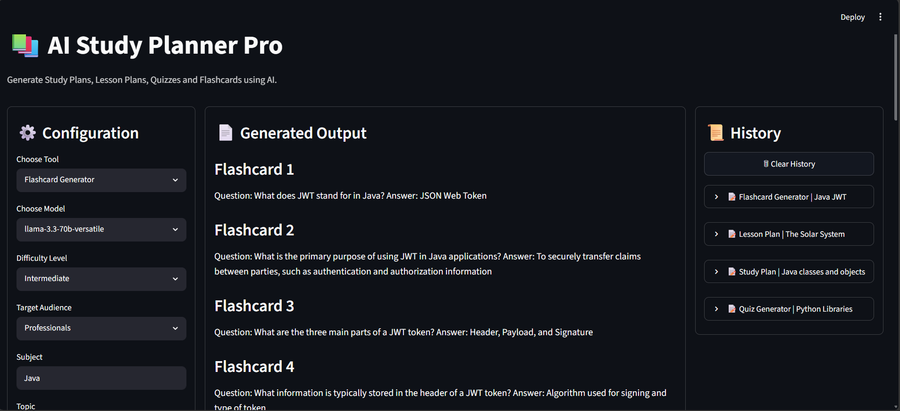

# 📚 AI Study Planner Pro

AI Study Planner Pro is a Streamlit-based AI application that helps users generate educational content using Large Language Models (LLMs).

The application can generate:
- Study Plans
- Lesson Plans
- Quizzes
- Flashcards
using AI-powered content generation through Groq-hosted LLMs.

## Preview



## 🚀 Features

### 📖 Study Plan Generator
Creates structured study plans with:

- Learning Goals
- Timelines
- Activities
- Practice Exercises
- Assessments

### 🧑‍🏫 Lesson Plan Generator
Generates complete lesson plans including:

- Objectives
- Teaching Activities
- Student Activities
- Assessments
- Summaries

### 📝 Quiz Generator
Creates:

- Multiple Choice Questions
- Short Answer Questions
- Answer Keys

### 🧠 Flashcard Generator
Creates interactive flashcard-style content for quick revision and memory retention.

### 🤖 Multiple LLM Support

Supported Models:

- llama-3.3-70b-versatile
- llama-3.1-8b-instant

### 📄 Export Options

Users can download generated content as:

- Markdown (.md)
- PDF (.pdf)

### 📜 Generation History

- Stores generated outputs during the current session
- Expandable history view
- Clear History functionality

---

## 🏗️ Project Architecture

The project follows a modular architecture with separation of concerns.

```text
AI Study Planner Pro
│
├── UI Layer (main.py)
│
├── Prompt Layer (prompts.py)
│
├── LLM Layer (llm.py)
│
├── PDF Export Layer (pdf_generator.py)
│
└── Assets Layer (styles.css)
````

### Why Modular Architecture?

Benefits:

* Easier maintenance
* Improved readability
* Better scalability
* Reusable components
* Cleaner debugging process
* Production-oriented code structure

---

## 📁 Folder Structure

```text
ai-study-planner/
│
├── main.py
│
├── assets/
│   └── styles.css
│
├── utils/
│   ├── llm.py
│   ├── prompts.py
│   └── pdf_generator.py
│
├── generated_files/
│
├── .streamlit/
│   └── secrets.toml
│
├── requirements.txt
│
├── .gitignore
│
└── README.md
```

---

## 📂 File Responsibilities

### main.py

Responsible for:

* Streamlit UI
* User Interaction
* Session State Management
* Download Functionality
* History Management

---

### utils/llm.py

Responsible for:

* LLM Initialization
* Model Loading
* Response Generation

Benefits:

* Centralized AI logic
* Easy model replacement
* Cleaner UI code

---

### utils/prompts.py

Responsible for:

* Prompt Engineering
* Prompt Templates
* Tool-specific Instructions

Benefits:

* Easy customization
* Reusable prompts
* Cleaner business logic

---

### utils/pdf_generator.py

Responsible for:

* PDF Generation
* Content Export

Benefits:

* Independent export module
* Easy future enhancement

---

### assets/styles.css

Responsible for:

* Application Styling
* Dashboard Appearance
* Layout Enhancements

Benefits:

* Separation of UI and Logic
* Easier design updates

---

## 🖥️ Dashboard Layout

The application uses a dynamic dashboard layout.

### Initial State

```text
┌───────────────┬────────────────────────────┐
│ Configuration │ Generated Output           │
└───────────────┴────────────────────────────┘
```

### After Generation

```text
┌───────────────┬──────────────────────┬────────────┐
│ Configuration │ Generated Output     │ History    │
└───────────────┴──────────────────────┴────────────┘
```

History is displayed only when generation records exist.

---

## ⚙️ Technologies Used

### Frontend

* Streamlit

### Backend

* Python

### AI Integration

* LangChain
* Groq API

### Exporting

* ReportLab

### Styling

* Custom CSS

---

## 🔐 API Key Configuration

Create:

```text
.streamlit/secrets.toml
```

Add:

```toml
GROQ_API_KEY = "your_api_key_here"
```

Never commit this file to GitHub.

---

## 🛠️ Installation

### Clone Repository

```bash
git clone [<repository-url>](https://github.com/Nandish-Magaji/AI-Study-Planner.git)
```

### Navigate to Project

```bash
cd ai-study-planner
```

### Create Virtual Environment

```bash
python -m venv venv
```

### Activate Environment

Windows:

```bash
venv\Scripts\activate
```

Linux / Mac:

```bash
source venv/bin/activate
```

### Install Dependencies

```bash
pip install -r requirements.txt
```

---

## ▶️ Run Application

```bash
streamlit run main.py
```

---

## 🎯 Future Improvements

Planned enhancements:

* SQLite Database Integration
* User Authentication
* Persistent History
* User Profiles
* Cloud Deployment
* Prompt Library
* AI Notes Generator
* Assignment Generator
* Multi-Language Support

---

## 📚 Learning Outcomes

This project demonstrates:

* Python Development
* Streamlit Development
* Prompt Engineering
* LLM Integration
* LangChain Usage
* Modular Architecture
* State Management
* API Security Practices
* File Export Functionality
* Software Design Principles

---

## 👨‍💻 Author

**Nandish MS**

